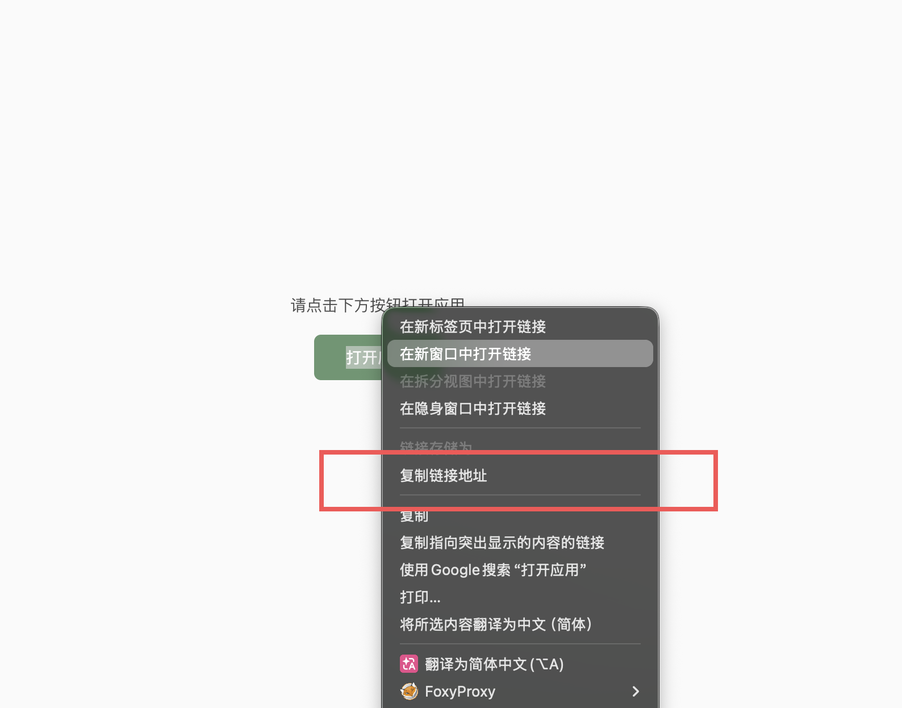

# ustc-iwan-c

本项目基于 [yyy1mu/ustc-iwan](https://github.com/yyy1mu/ustc-iwan) 重写并优化（C11 / CMake）。

USTC iWAN 命令行客户端，用于通过统一身份认证获取线路配置，并通过 SOCKS5 代理或 TUN 隧道连接。

主要功能：

- 通过 OIDC 登录获取 iWAN 线路配置。
- 将线路配置保存到本机，后续可直接离线查看线路列表。
- 选择线路建立 TUN 隧道或 SOCKS 隧道。
- 按 IP、域名或 CIDR 精确控制哪些流量进入隧道。

仓库包含三个二进制：

| 二进制 | 用途 |
|--------|------|
| `iwan-client-oidc` | 推荐使用。负责登录、保存线路配置、选择线路并连接。 |
| `iwan-client` | 手动指定服务器、用户名和密码，适合调试或自定义接入。 |
| `iwan-server` | 自建兼容测试服务端，普通用户通常不需要。仅 Linux。 |

两个客户端均支持 TUN 模式和 SOCKS5 模式，其中 SOCKS5 模式不需要root/管理员权限。

## 系统要求

- Linux TUN 模式连接时需要 root 权限。程序通过 `ip` 命令配置接口与路由，这些子进程不继承 capability，因此仅给程序设置 `CAP_NET_ADMIN` 不足以工作。
- Windows TUN 模式连接时需要管理员权限，并且程序同目录下存在 `wintun.dll`。
- macOS TUN 模式连接时需要 root 权限（程序会自动 `sudo` 重执行；macOS 没有 Linux 的 `CAP_NET_ADMIN` capability 机制）。
- SOCKS5 模式不需要上述权限。

## 下载

从 [GitHub Releases](https://github.com/Jerrid-Huang/ustc-iwan-c/releases) 下载对应平台的压缩包：

| 平台 | 资产 |
|------|------|
| Linux x86_64（glibc） | `iwan-linux-x86_64.tar.gz` |
| Linux 各架构（静态 musl） | `iwan-linux-<arch>-musl.tar.gz`（x86_64 / i686 / aarch64 / armv7 / riscv64 / ppc64le / s390x） |
| Windows | `iwan-windows-<arch>.zip`（x86_64 / i686 / arm64） |
| macOS | `iwan-macos-<arch>.zip`（x86_64 / arm64） |

压缩包内包含对应平台的 `iwan-client`、`iwan-client-oidc`（及 Linux 的 `iwan-server`）。Windows 包内为静态 exe，OpenSSL 与运行库已内嵌，无需任何 DLL。

源码构建产物位于：

```text
bin/
```

## OIDC 使用流程

### 1. 获取线路配置

Linux/MacOS:
```bash
./iwan-client-oidc --fetch
```

Windows cmd:
```bash
iwan-client-oidc.exe --fetch
```

Windows PowerShell:
```bash
.\iwan-client-oidc.exe --fetch
```

命令会输出登录链接。用浏览器打开链接并完成认证后，将回调 URL 粘贴回终端。

如果浏览器提示打开 `iWAN.app`，选择取消，保留在当前网页：


随后在页面按钮上复制链接地址，将复制到的 `com.panabit.mobile://...` 回调 URL 粘贴回终端：



配置保存位置：

Linux/MacOS:
```text
~/.config/iwan/servers.json
```

Windows:
```text
C:\Users\<用户名>\.config\iwan\servers.json
```

配置文件包含线路地址、用户名和加密后的线路密码。`--list` 只读取线路信息，不解密密码。

### 2. 列出本地线路

Linux/MacOS:
```bash
./iwan-client-oidc --list
```

Windows cmd:
```bash
iwan-client-oidc.exe --list
```

Windows PowerShell:
```bash
.\iwan-client-oidc.exe --list
```

示例输出：

```text
 1. 教育网线路                          <server-ip>:6001
 2. 电信线路                           <server-ip>:6002
 3. 联通线路                           <server-ip>:6001
 4. 移动线路                           <server-ip>:6001
```

如果配置文件不存在，命令会提示先执行 `--fetch`。

### 3. 连接

Linux/MacOS:
```bash
sudo ./iwan-client-oidc -c --ustc
```

Windows cmd (管理员):
```bash
iwan-client-oidc.exe -c --ustc
```

Windows PowerShell (管理员):
```bash
.\iwan-client-oidc.exe -c --ustc
```

命令会读取本地配置并显示线路列表。输入序号后，只解密所选线路的密码，并建立 TUN 隧道。

配置用普通用户执行 `--fetch` 保存即可。连接时不需要把配置文件复制到 root 用户目录。

跳过交互选择，直接连接指定线路（按配置名或 `host:port`）：

```bash
sudo ./iwan-client-oidc -c --ustc --server 移动线路
sudo ./iwan-client-oidc -c --ustc --server 202.38.64.106:6001
```

### 无 TUN 的 SOCKS5 模式

Linux / macOS：

```bash
./iwan-client-oidc --connect --socks \
  --socks-listen 127.0.0.1:1080 \
  --socks-mtu 1380
```

Windows PowerShell：

```powershell
.\iwan-client-oidc.exe --connect --socks `
  --socks-listen 127.0.0.1:1080 `
  --socks-mtu 1380
```

三个平台均使用 `--socks` 显式启用 SOCKS5 模式。默认监听
`127.0.0.1:1080`，默认用户态内层 MTU 为 `1380`，可以通过
`--socks-listen` 和 `--socks-mtu` 修改这两个值。

当前 SOCKS5 模式支持 `CONNECT`、IPv4 地址目标和域名目标。域名由客户端
通过固定的 `114.114.114.114:53` 在本机解析为 IPv4 地址，例如：

```bash
curl --socks5-hostname 127.0.0.1:1080 https://www.example.com/
```

不支持 IPv6、SOCKS5 `BIND` 或 `UDP ASSOCIATE`。这些请求会收到对应的
SOCKS5 错误响应。

同一端口同时接受 HTTP 代理握手（浏览器系统代理可直接指向
`127.0.0.1:1080`）。设置了 `--socks-token` 后 HTTP 模式自动禁用。

#### SOCKS5 代理密码

仅监听本地（默认）时代理无密码。监听非回环地址
（`--listen 0.0.0.0:1080` 或 `--socks-listen`）时，必须显式指定代理
密码，或显式声明开放代理：

```bash
# 远程客户端需提供密码（RFC1929 username/password 认证）
./iwan-client-oidc --connect --socks \
  --socks-listen 0.0.0.0:1080 --allow-remote --socks-token <PASS>

# 显式确认开放（无密码）代理
./iwan-client-oidc --connect --socks \
  --socks-listen 0.0.0.0:1080 --allow-remote --socks-no-token
```

`--allow-remote` 未指定密码且未声明 `--socks-no-token` 时程序拒绝启动。
`--socks-token` 与 `--socks-no-token` 互斥；token 最长 255 字节
（RFC1929 限制）。`iwan-client socks` 的对应参数为 `--listen` 与
`--socks-token` / `--socks-no-token` / `--allow-remote`。

### 4. 一次完成

```bash
sudo ./iwan-client-oidc --all
```

该命令依次完成：

```text
--fetch -> --list -> --connect
```

## 路由规则

默认连接只创建并配置 `iwan0`，不会修改业务流量路由。

需要让指定目标走 iWAN 时，显式传入代理规则：

```bash
sudo ./iwan-client-oidc --connect \
  --proxy-ip 1.1.1.1,2.2.2.2 \
  --proxy-domain example.com,api.example.com \
  --proxy-cidr 10.0.0.0/8
```

参数说明：

| 参数 | 说明 |
|------|------|
| `--proxy-ip` | 指定 IPv4 地址，自动转换为 `/32` 路由。 |
| `--proxy-domain` | 连接前解析域名，并把解析得到的 IPv4 地址加入路由。 |
| `--proxy-cidr` | 指定 CIDR 网段，例如 `10.0.0.0/8` 或 `0.0.0.0/0`。 |
| `--tun` | TUN 设备名，默认 `iwan0`。 |
| `--encrypt` | 协议加密模式，默认 `1`。 |

代理参数可以重复，也可以用逗号分隔：

```bash
--proxy-ip 1.1.1.1,2.2.2.2
--proxy-ip 1.1.1.1 --proxy-ip 2.2.2.2
```

将全部流量路由到 iWAN：

```bash
sudo ./iwan-client-oidc --connect --proxy-cidr 0.0.0.0/0
```

注意：域名只在连接时解析一次。连接后域名解析变化不会自动同步到路由表。

## OIDC 命令参数

| 参数 | 行为 |
|------|------|
| `--fetch` | 通过 OIDC 登录并保存线路配置。 |
| `--list` | 读取本地配置并列出线路，不联网，不解密密码。 |
| `--connect` | 只读取本地配置，选择线路并连接。 |
| `--all` | 拉配置、列线路、选择并连接。 |
| `--config-dir <DIR>` | 指定配置目录，默认 `~/.config/iwan`。 |
| `--server <NAME\|HOST:PORT>` | 跳过线路选择，直接按配置名（如 `--server 移动线路`）或 `host:port` 连接指定线路。 |
| `--ustc` | 将全部校园网 CIDR 加入代理路由（`--connect` 的快捷方式）。 |

必须指定 `--fetch`、`--list`、`--connect`、`--all` 中的至少一个动作。

## 手动客户端

`iwan-client` 不使用 OIDC，需要手动提供服务器、用户名和密码。

```bash
./iwan-client ping --server <SERVER_IP> --port 6001
```

仅测试认证：

```bash
./iwan-client auth \
  --server <SERVER_IP> \
  --port 6001 \
  --user <USER> \
  --pass '<PASSWORD>'
```

建立隧道：

```bash
sudo ./iwan-client proxy \
  --server <SERVER_IP> \
  --port 6001 \
  --user <USER> \
  --pass '<PASSWORD>' \
  --proxy-ip 1.1.1.1,2.2.2.2
```

不创建 TUN，启动用户态 SOCKS5 代理：

```bash
./iwan-client socks \
  --server <SERVER_IP> \
  --port 6001 \
  --user <USER> \
  --pass '<PASSWORD>' \
  --listen 127.0.0.1:1080
```

## 从源码构建

依赖：`cmake`（≥3.16）、C11 编译器、OpenSSL 头文件与 `libcrypto`（Debian/Ubuntu 装 `libssl-dev`；macOS 装 `brew install openssl@3`）。

```bash
cmake -B build
cmake --build build -j      # 产物在 bin/
```

macOS 需显式指定 Homebrew OpenSSL（keg-only），且只构建客户端（`iwan-server` 仅 Linux）：

```bash
cmake -B build -DOPENSSL_ROOT_DIR="$(brew --prefix openssl@3)"
cmake --build build -j      # iwan-client / iwan-client-oidc
```

Windows 交叉编译（在 Linux 上）需要 MinGW-w64 工具链与 OpenSSL sysroot，见
[`.github/workflows/build.yml`](.github/workflows/build.yml) 中的 `win-cross` / `macos` 任务。

## SOCKS5 模式的 TCP 栈（lwIP）

SOCKS5 模式内置一个用户态 TCP 栈，用来把本地客户端的字节流重新打包成隧道内的
TCP 段。默认使用 vendored 的 [lwIP 2.2.1](third_party/lwip/README.iwan)
（BSD-3-Clause，`NO_SYS=1` raw API，无 socket 层，单线程跑在现有事件循环里），
提供完整的 TCP：慢启动/拥塞控制、快速重传、乱序段重组（`TCP_QUEUE_OOSEQ`）与
SACK 输出（`LWIP_TCP_SACK_OUT`）、窗口缩放、RTO。

旧的 1458 行手写 `netstack.c` 保留了一个版本周期作为回退，用 CMake 选项切换：

```bash
cmake -B build -DIWAN_TCP_STACK=lwip      # 默认（lwIP）
cmake -B build -DIWAN_TCP_STACK=native    # 回退到旧的 netstack.c
```

桥接层在 [`src/common/lwip_bridge.c`](src/common/lwip_bridge.c)，对 SOCKS 层暴露
与原 netstack 完全相同的 `ns_*` 接口（`src/common/tcpstack.h` 做二选一分发），
因此 `socks.c` / `socks_flow.c` 无需改动。lwIP 配置在
[`third_party/lwip/lwipopts.h`](third_party/lwip/lwipopts.h)，移植层在
[`third_party/lwip/port/arch/cc.h`](third_party/lwip/port/arch/cc.h)。详见
[`docs/lwip-bridge.md`](docs/lwip-bridge.md)。

root-free 的数据面测试在 [`tests/lwip_data_harness.c`](tests/lwip_data_harness.c)：
用进程内 fake TCP 对端回显一个 64KB 模式，覆盖三种情形——顺序、乱序注入
（`IWAN_TEST_REORDER=1`）、丢包重传恢复（`IWAN_TEST_DROP_ONCE=1`）。

## 服务端

`iwan-server` 用于自建测试环境。连接 USTC iWAN 不需要运行服务端。

用户文件格式（每行 `username:password`，权限必须为 600，否则服务器拒绝启动）：

```bash
printf 'alice:s3cret-pass\n' | sudo tee /etc/iwan/users.txt
sudo chmod 600 /etc/iwan/users.txt
```

```bash
sudo ./iwan-server \
  --port 6001 \
  --tun iwan-srv \
  --server-ip 198.18.0.1 \
  --subnet 198.18.0.0/16 \
  --dns 114.114.114.114 \
  --users /etc/iwan/users.txt \
  --nat-if eth0
```

服务器启动时自动启用 IPv4 转发并配置 iptables MASQUERADE（需要 root，
`--no-tun` 测试模式除外），无需手动执行：

```bash
# 等价于程序启动时自动执行的步骤：
echo 1 | sudo tee /proc/sys/net/ipv4/ip_forward
sudo iptables -t nat -A POSTROUTING -s 198.18.0.0/16 -o eth0 -j MASQUERADE
```

## 免责声明

本项目仅供学习、研究和合法授权访问使用。使用者应自行确认其使用方式符合所在网络和服务的规则。

## License

[MIT](LICENSE)
